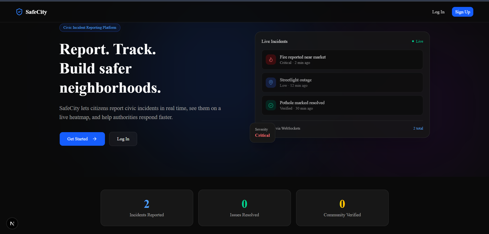
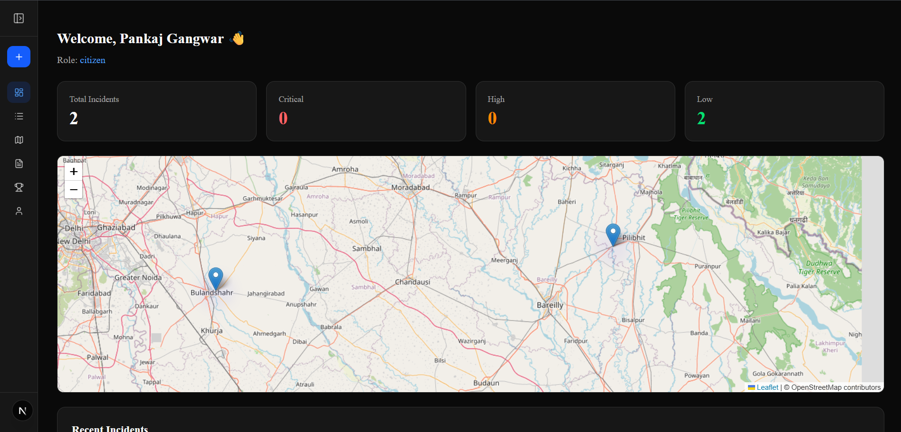
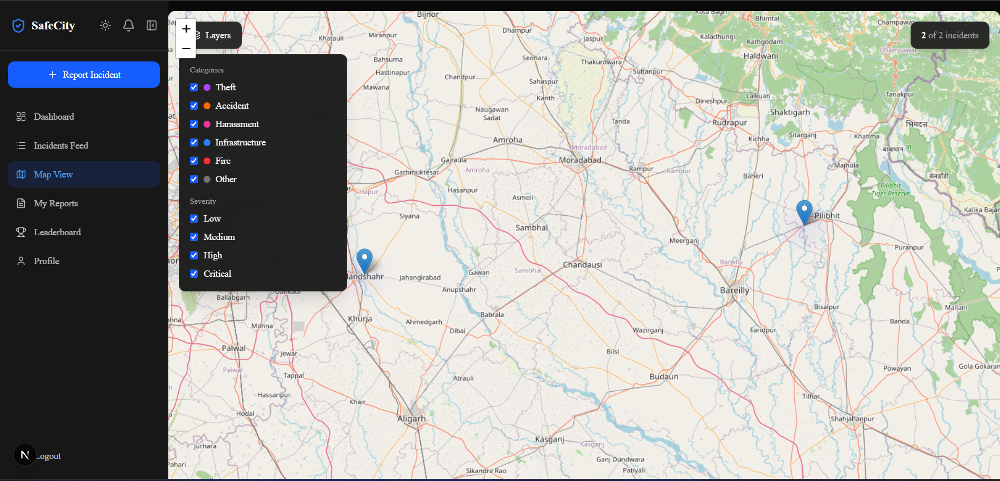
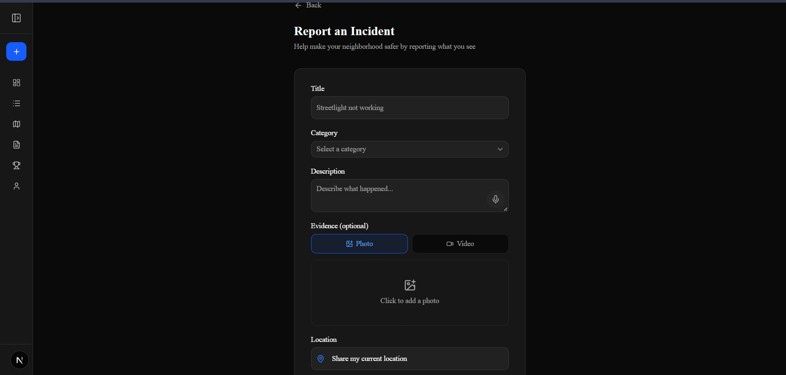
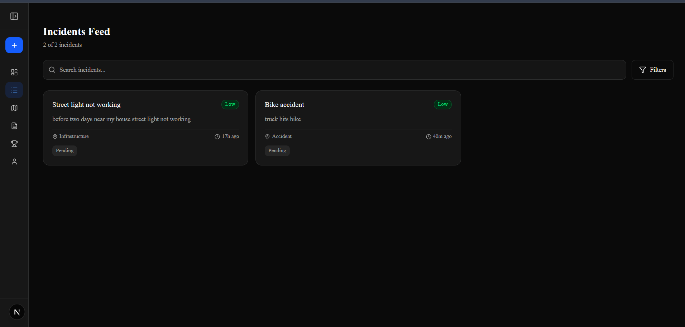
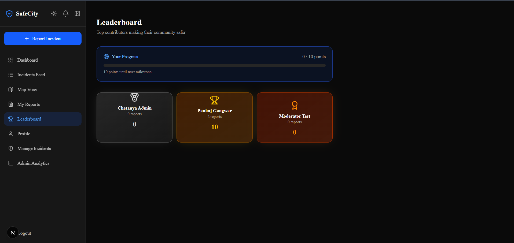
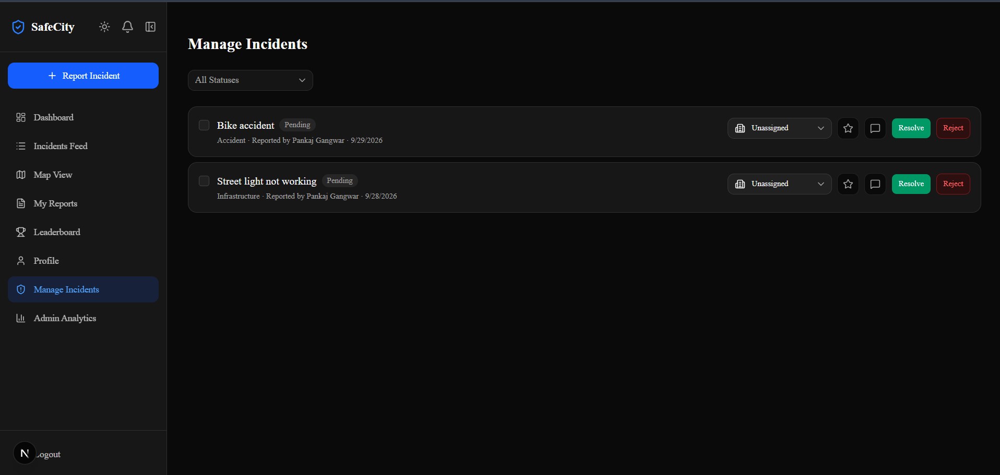
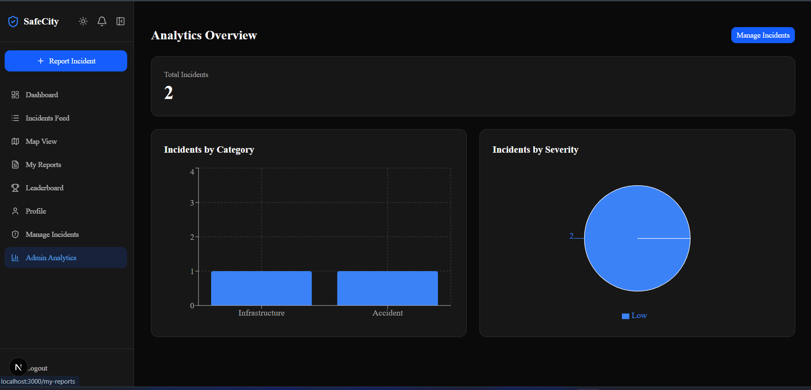
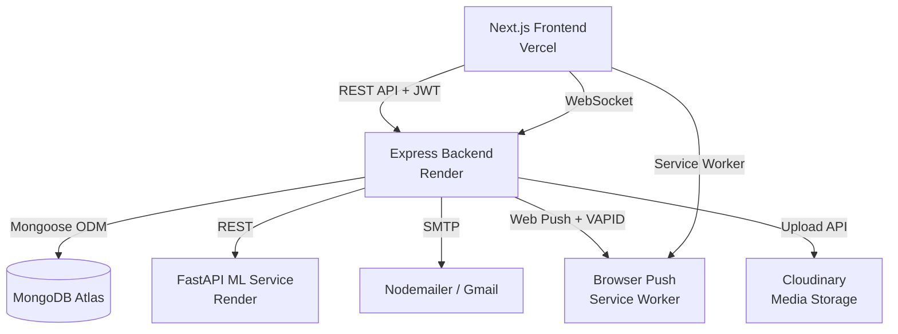

<div align="center">

# 🛡️ SafeCity

### AI-Powered Civic Incident Reporting & Community Safety Platform

A full-stack, production-grade civic-tech platform that lets citizens report, verify, and track local incidents in real time — with AI-driven severity prediction, live notifications, gamified community engagement, and role-based moderation.

[](https://safecity-m6nr.vercel.app)
[](https://safecity-backend-6ua7.onrender.com)
[](#license)

</div>

---

## 📖 Table of Contents

- [Overview](#-overview)
- [Live Links](#-live-links)
- [Screenshots](#-screenshots)
- [Feature Highlights](#-feature-highlights)
- [Tech Stack](#-tech-stack)
- [System Architecture](#-system-architecture)
- [Project Structure](#-project-structure)
- [Getting Started (Local Setup)](#-getting-started-local-setup)
- [Environment Variables](#-environment-variables)
- [API Overview](#-api-overview)
- [Deployment](#-deployment)
- [Roadmap](#-roadmap)
- [License](#-license)

---

## 🌆 Overview

**SafeCity** turns everyday citizens into active participants in community safety. Instead of incidents going unreported or unnoticed, anyone can drop a pin, snap a photo or video, and have it instantly:

- 📍 Geo-tagged and plotted on a live city-wide heatmap
- 🤖 Auto-classified by severity using a trained ML model (TF-IDF + Naive Bayes)
- ✅ Verified by the community (3 independent verifications auto-promote a report to "Verified")
- 🔔 Tracked in real time — with Socket.io in-app alerts **and** native browser push notifications that work even when the tab is closed
- 🏛️ Escalated to moderators/admins, who can assign departments, set priority, and manage the full incident lifecycle

Built as a portfolio-grade capstone project with **industry-level architecture**: a decoupled TypeScript backend, a Python ML microservice, real-time infrastructure, and a fully responsive, theme-aware Next.js frontend.

---

## 🔗 Live Links

| Service | URL | Hosted On |
|---|---|---|
| **Frontend** | [safecity-m6nr.vercel.app](https://safecity-m6nr.vercel.app) | Vercel |
| **Backend API** | [safecity-backend-6ua7.onrender.com](https://safecity-backend-6ua7.onrender.com) | Render |
| **ML Microservice** | [safecity-ml-service.onrender.com](https://safecity-ml-service.onrender.com) | Render |
| **Database** | MongoDB Atlas (Cloud) | MongoDB Atlas |

> ⚠️ Backend and ML service run on Render's free tier — the first request after inactivity may take 30–50 seconds to "wake up."

---

## 📸 Screenshots

<div align="center">

### Landing Page


### Dashboard


| Live Incident Map | Report an Incident |
|---|---|
|  |  |

| Incidents Feed | Leaderboard |
|---|---|
|  |  |

| Admin — Manage Incidents | Admin — Analytics |
|---|---|
|  |  |

</div>

---

## ✨ Feature Highlights

### 🧭 Core Platform
- **JWT authentication** with bcrypt password hashing, Zod validation, and rate limiting
- **OTP-based email verification** (6-digit code, auto-advance inputs, resend cooldown) — signup is blocked until verified
- **Forgot / reset password** flow reusing the OTP pattern, with a built-in "generate strong password" tool and user-enumeration protection
- **Geospatial incident reporting** with MongoDB `2dsphere` indexing, 100m-radius duplicate detection, and browser geolocation
- **Photo & video evidence** — upload existing media or record live in-browser via `MediaRecorder` with a 30-second auto-stop timer
- **Voice-to-text reporting** using the Web Speech API, appending transcribed text into the description field

### 🤖 AI / ML
- **Custom-trained severity classifier** (TF-IDF + Multinomial Naive Bayes via scikit-learn) served through a dedicated **FastAPI microservice**
- Automatic fallback to "Low" severity if the ML service is unreachable, so the core app never breaks

### 🗺️ Real-Time & Maps
- **Live incident heatmap** (Leaflet.js) with real-time marker updates via **Socket.io** — no page refresh needed
- **Community verification system**: 3 independent verifications auto-promote a report to "Verified" (self-verification is blocked)
- **Threaded comments** on incidents in real time (self-commenting is intentionally allowed)

### 🔔 Notifications (Dual-Channel)
- **In-app notification center**: portal-rendered dropdown with All/Unread tabs, mark-all-read, clear-all, type-specific icons, and toast pop-ups for new events — powered by Socket.io personal rooms
- **Native browser push notifications** (Web Push API + VAPID + Service Worker) that fire **even when the browser tab is closed** — triggered on verification, auto-verification, and status changes (single & bulk)
- **Transactional emails** via Nodemailer with professional HTML templates for verification, status updates, and password resets

### 🏆 Gamification
- Points system (+5 for reporting, +1 for verifying, +2 when your report gets verified)
- **Animated podium leaderboard** (top 3) with progress bars toward the next milestone

### 🛂 Role-Based Access Control
- Three roles: `citizen`, `moderator`, `admin`
- Moderators/admins get a dedicated incident-management dashboard: bulk status updates, department assignment, priority flagging, and an internal notes/audit trail (`statusHistory`)
- Admin-only analytics dashboard with MongoDB aggregation pipelines visualized via Recharts

### 🎨 UX & PWA
- **Full dark/light theme system** (`next-themes` + Tailwind v4 semantic tokens) applied consistently across every page, chart, and map popup
- **Installable Progressive Web App** with offline fallback caching via a hand-written service worker
- **Multi-page, sidebar-driven layout** (collapsible, `Ctrl+B` shortcut) modeled after modern SaaS dashboards rather than a single cluttered page
- Fully **responsive and accessible** UI built with shadcn/ui + Tailwind CSS + Framer Motion

---

## 🧰 Tech Stack

<div align="center">

| Layer | Technologies |
|---|---|
| **Frontend** | Next.js (App Router), React, TypeScript, Tailwind CSS v4, shadcn/ui, Framer Motion, Recharts, Leaflet.js |
| **Backend** | Node.js, Express, TypeScript, Socket.io, JWT, bcrypt, Zod, Multer |
| **ML Microservice** | Python, FastAPI, scikit-learn, pandas, Uvicorn |
| **Database** | MongoDB Atlas (Mongoose ODM, geospatial indexing) |
| **Real-Time** | Socket.io (rooms-based personal notifications) |
| **Notifications** | Web Push API, VAPID, Service Workers, Nodemailer |
| **Media Storage** | Cloudinary (image + video, `MediaRecorder` for live capture) |
| **Auth** | JWT, bcrypt, OTP email verification |
| **Deployment** | Vercel (frontend), Render (backend + ML service), MongoDB Atlas (database) |
| **DevOps** | Git, GitHub, environment-based configuration, CORS whitelisting |

</div>

---

## 🏗️ System Architecture



**Why a separate ML microservice?** Decoupling severity prediction from the core API means the Node.js backend never blocks on Python inference, and the ML model can be retrained/redeployed independently without touching the main app.

---

## 📁 Project Structure

```
safecity/
├── backend/                 # Node.js + Express + TypeScript API
│   ├── src/
│   │   ├── config/          # DB, Cloudinary, email, web-push config
│   │   ├── middleware/      # Auth, admin/moderator guards, validation
│   │   ├── models/          # Mongoose schemas
│   │   ├── routes/          # REST endpoints
│   │   ├── jobs/            # Scheduled risk-zone calculation
│   │   ├── scripts/         # One-off migration scripts
│   │   └── server.ts        # App entrypoint
│   └── package.json
│
├── frontend/                 # Next.js App Router frontend
│   ├── app/                  # Route segments (dashboard, incidents, admin, auth, etc.)
│   ├── components/           # Shared UI (Sidebar, Map, NotificationBell, etc.)
│   ├── lib/                  # API client, socket client, auth helpers
│   └── public/               # PWA manifest, service worker, icons
│
├── ml-service/                # Python FastAPI severity-prediction microservice
│   ├── main.py
│   ├── train_model.py
│   ├── severity_model.pkl
│   └── requirements.txt
│
└── README.md
```

---

## 🚀 Getting Started (Local Setup)

### Prerequisites
- Node.js 18+
- Python 3.11+
- A MongoDB Atlas connection string
- A Cloudinary account
- A Gmail account with an App Password (for transactional email)

### 1. Clone the repository
```bash
git clone https://github.com/chetanyapr-sys/safecity.git
cd safecity
```

### 2. Backend setup
```bash
cd backend
npm install
# Create a .env file (see Environment Variables below)
npm run dev        # runs on http://localhost:5000
```

### 3. Frontend setup
```bash
cd frontend
npm install
# Create a .env.local file (see Environment Variables below)
npm run dev        # runs on http://localhost:3000
```

### 4. ML service setup
```bash
cd ml-service
python -m venv venv
venv\Scripts\activate        # Windows
# source venv/bin/activate   # macOS/Linux
pip install -r requirements.txt
uvicorn main:app --reload --port 8000
```

All three services must be running simultaneously for full functionality.

---

## 🔐 Environment Variables

### `backend/.env`
```
MONGO_URI=
JWT_SECRET=
PORT=5000
CLOUDINARY_CLOUD_NAME=
CLOUDINARY_API_KEY=
CLOUDINARY_API_SECRET=
EMAIL_USER=
EMAIL_APP_PASSWORD=
VAPID_PUBLIC_KEY=
VAPID_PRIVATE_KEY=
VAPID_SUBJECT=mailto:you@example.com
ML_SERVICE_URL=http://localhost:8000
FRONTEND_URL=http://localhost:3000
```

### `frontend/.env.local`
```
NEXT_PUBLIC_API_URL=http://localhost:5000
NEXT_PUBLIC_VAPID_PUBLIC_KEY=
```

> Generate VAPID keys with: `npx web-push generate-vapid-keys`

---

## 📡 API Overview

| Method | Endpoint | Description |
|---|---|---|
| `POST` | `/api/auth/signup` | Register a new citizen account |
| `POST` | `/api/auth/verify-otp` | Verify email via OTP, auto-login on success |
| `POST` | `/api/auth/login` | Authenticate and receive a JWT |
| `POST` | `/api/auth/forgot-password` / `/reset-password` | OTP-based password reset |
| `GET` / `POST` | `/api/incidents` | List / create incidents (with ML severity prediction) |
| `GET` | `/api/incidents/nearby` | Geospatial radius search |
| `POST` | `/api/incidents/:id/verify` | Community verification (auto-verifies at 3) |
| `GET` | `/api/admin/incidents` | Moderator/admin incident management |
| `PATCH` | `/api/admin/incidents/:id/status` | Update status (single or bulk) |
| `GET` | `/api/leaderboard` | Top contributors by points |
| `POST` | `/api/push/subscribe` | Register a browser for push notifications |
| `POST` | `/predict-severity` *(ML service)* | Returns predicted severity + confidence for a description |

---

## ☁️ Deployment

| Component | Platform | Notes |
|---|---|---|
| Frontend | **Vercel** | Auto-deploys from `main`, root directory set to `frontend/` |
| Backend | **Render** (Web Service, Node) | Root directory `backend/`, build via `tsc`, served via `node dist/server.js` |
| ML Service | **Render** (Web Service, Python) | Root directory `ml-service/`, served via `uvicorn main:app --host 0.0.0.0 --port $PORT` |
| Database | **MongoDB Atlas** | Fully managed, cloud-hosted |

CORS on the backend is environment-driven (`FRONTEND_URL`), so the same codebase works identically in local development and production without code changes.

---

## 🗺️ Roadmap

- [ ] Rich analytics export (CSV/PDF reports for admins)
- [ ] Multi-language support
- [ ] SMS fallback for critical incident alerts
- [ ] Public API rate-limit tiers for third-party integrations

---

## 📄 License

This project is licensed under the **MIT License** — feel free to use it as a reference or starting point for your own civic-tech projects.

---

<div align="center">

Built with ❤️ as a full-stack capstone project — combining real-time systems, machine learning, and modern web engineering.

</div>